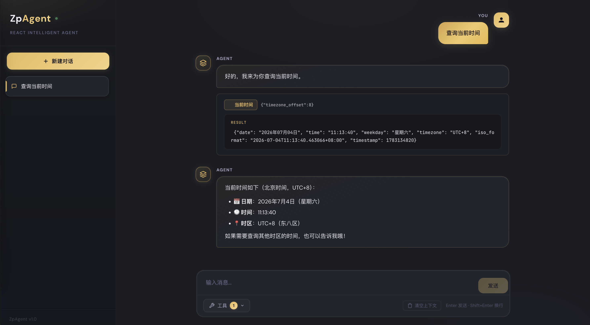
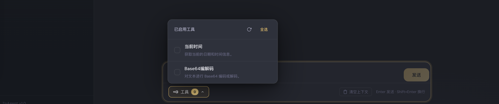
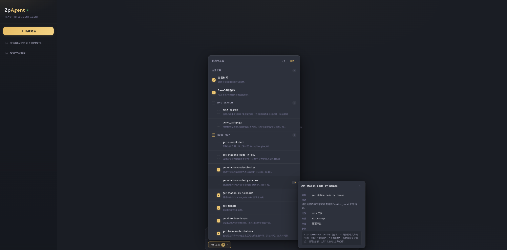
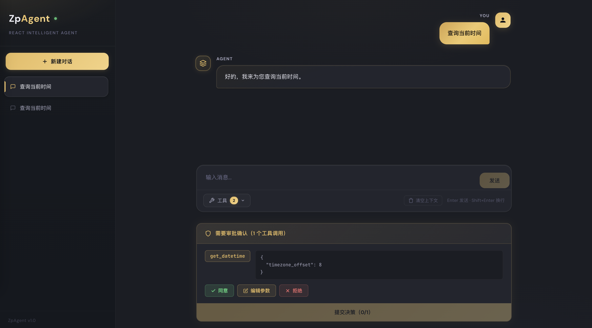
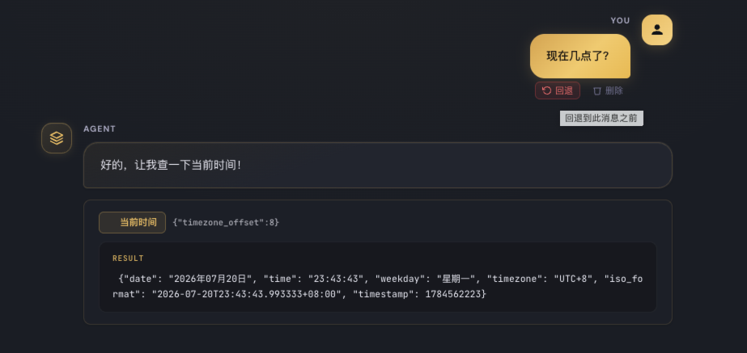
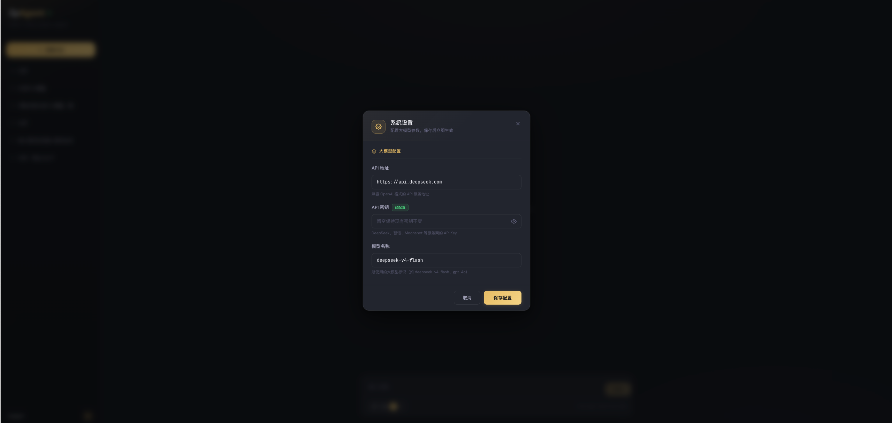

# ZpAgent - ReAct ChatBot智能体项目

基于 **LangChain 1.2 + LangGraph + FastAPI + Vue 3** 构建的 ReAct 范式智能体，支持 SSE 流式输出、动态工具多选、多轮会话记忆和 Human-in-the-Loop 工具审批。

## 功能特性

- **ReAct 推理循环**：思考 → 行动 → 观察 → 再思考，完整展示 Agent 决策过程
- **SSE 流式输出**：逐 token 实时推送，打字机效果呈现回答
- **动态工具选择**：前端可按需勾选启用/禁用的工具，支持内置工具 + MCP 外部工具
- **Human-in-the-Loop**：敏感工具需用户审批后执行，支持批准/编辑/拒绝/自行回复
- **多轮会话记忆**：双层存储架构（元数据 + 对话状态），支持 InMemory / MySQL 后端切换
- **会话顶置**：重要会话可通过三点菜单顶置到列表顶部，支持多会话顶置、顶置排序和取消顶置
- **消息删除与回退**：用户消息支持"删除"（级联删除该消息及后续所有消息）和"回退"（删除后回填输入框重新编辑），保证对话上下文一致
- **MCP 工具扩展**：通过 `mcp_servers.json` 配置加载外部 MCP 工具服务
- **页面配置大模型**：前端设置面板直接修改 API 地址、密钥和模型名称，保存后热重载立即生效，无需重启服务

## 界面预览

- 对话界面



- 支持内置工具与MCP



- 工具详情展示



- 支持Human-in-the-Loop人工介入



- 支持消息回退与删除

  

- 页面支持模型配置



## 项目架构

```
ZpAgent-Python/
├── zpagent.sh                       # 一键启动/停止/重启脚本
├── back/                            # 后端（Python + FastAPI + LangChain + LangGraph）
│   ├── main.py                      # FastAPI 应用入口
│   ├── config.py                    # 配置管理（pydantic-settings）
│   ├── .env                         # 环境变量（API Key 等，不提交 Git）
│   ├── mcp_servers.json             # MCP 外部工具服务配置
│   ├── agent/
│   │   ├── __init__.py              # ReAct Agent 编排层（流式事件 + HITL + 会话管理）
│   │   └── graph.py                 # LangGraph Agent 图工厂（create_agent）
│   ├── llm/
│   │   └── __init__.py              # LLM 客户端（ChatOpenAI）
│   ├── tools/
│   │   ├── __init__.py              # 工具导出
│   │   ├── builtin_tools.py         # 内置工具（位置/时间/天气）
│   │   ├── mcp_loader.py            # MCP 工具加载器
│   │   └── registry.py             # 工具注册表（HITL 策略管理）
│   ├── conversation/                # 会话元数据存储（策略模式）
│   │   ├── __init__.py              # 工厂函数 + 导出
│   │   ├── base.py                  # 抽象基类
│   │   ├── memory_store.py          # InMemory 实现
│   │   └── mysql_store.py           # MySQL 实现
│   ├── checkpoint/                  # 对话状态存储（策略模式）
│   │   ├── __init__.py              # 工厂函数 + 导出
│   │   ├── base.py                  # 抽象基类
│   │   ├── memory_store.py          # InMemory 实现
│   │   └── mysql_store.py           # MySQL 实现
│   ├── entity/
│   │   ├── __init__.py              # Pydantic 数据模型（统一导出）
│   │   ├── chat/                    # 聊天相关（Message、ChatRequest、Decision、DecideRequest）
│   │   ├── conversation/            # 会话管理（ConversationInfo、ConversationDetail、RenameRequest）
│   │   ├── tool/                    # 工具相关（ToolInfo）
│   │   └── common/                  # 公共模型（ApiResponse、LlmConfigRequest、LlmConfigResponse）
│   ├── services/
│   │   ├── __init__.py              # 服务层导出
│   │   └── config_service.py        # 配置服务（.env 读写 + 热重载）
│   ├── routers/
│   │   └── api.py                   # 统一 API 路由（聊天 + HITL + 会话 + 工具 + 配置管理）
│   └── requirements.txt             # Python 依赖
│
└── front/                           # 前端（Vue 3 + Vite）
    ├── package.json
    ├── vite.config.js               # Vite 配置（含 SSE 代理）
    ├── index.html
    └── src/
        ├── main.js
        ├── App.vue                  # 根组件（全局状态管理）
        ├── style.css                # 全局样式
        ├── api/
        │   └── index.js             # API 封装（REST + SSE 流式）
        ├── views/
        │   └── ChatView.vue         # 聊天主视图
        ├── utils/
        │   └── index.js             # 工具函数 + 工具中文名映射
        └── components/
            ├── ChatMessage.vue      # 消息组件（含 ReAct 思考过程）
            ├── ConversationList.vue # 侧边栏会话列表（含设置入口）
            ├── ToolSelector.vue     # 工具多选栏
            ├── ApprovalPanel.vue    # HITL 工具审批面板
            ├── SettingsDialog.vue   # 系统设置弹窗（大模型配置）
            └── ConfirmDialog.vue    # 通用确认弹窗
```

## 技术栈

| 层面 | 技术 | 版本 | 说明 |
|------|------|------|------|
| 后端框架 | FastAPI | 0.115+ | 高性能异步 Web 框架 |
| AI 框架 | LangChain | 1.2+ | LLM 调用 + 工具绑定 + astream_events 流式 |
| Agent 引擎 | LangGraph | 1.2+ | ReAct 状态图 + checkpointer + HITL |
| LLM API | OpenAI 兼容 | — | DeepSeek / 智谱 / Moonshot / OpenAI 等 |
| 流式传输 | SSE | — | Server-Sent Events 逐 token 实时输出 |
| 前端框架 | Vue 3 + Vite | 3.5+ / 5.4+ | Composition API + 快速热更新 |
| 会话记忆 | 双层存储 | — | 元数据（conversation）+ 对话状态（checkpoint），支持 InMemory / MySQL |

## 快速启动（推荐）

项目提供 `zpagent.sh` 一键管理脚本，自动处理虚拟环境检测、依赖安装和服务管理。

### 前置条件

1. 编辑 `back/.env`，配置你的 LLM API 密钥：
   ```bash
   cd back
   cp .env.example .env    # 如果没有 .env，从模板复制
   # 编辑 .env，将 API_KEY=your-api-key-here 改为你的实际 Key
   ```

2. 首次使用前需手动创建 Python 虚拟环境（仅一次）：
   ```bash
   cd back
   python3 -m venv venv
   source venv/bin/activate
   pip install -r requirements.txt
   ```

### 一键启动

```bash
# 赋予脚本执行权限（首次）
chmod +x zpagent.sh

# 启动所有服务（后端 + 前端）
./zpagent.sh start
```

启动成功后输出：

```
==============================
  ZpAgent 启动
==============================
[INFO] 启动后端服务...
[OK] 后端服务已启动 (PID: 12345)
[INFO] API 文档: http://localhost:8000/docs
[INFO] 启动前端服务...
[OK] 前端服务已启动 (PID: 12346)
[INFO] 前端地址: http://localhost:5173

==============================
  ZpAgent 服务已全部启动
  后端:  http://localhost:8000
  前端:  http://localhost:5173
  API:   http://localhost:8000/docs
==============================
```

### 脚本命令一览

```bash
./zpagent.sh {start|stop|restart|status} [backend|frontend|all]
```

| 命令 | 说明 | 示例 |
|------|------|------|
| `start` | 启动服务 | `./zpagent.sh start` — 启动前后端 |
| `stop` | 停止服务 | `./zpagent.sh stop` — 停止所有服务 |
| `restart` | 重启服务 | `./zpagent.sh restart` — 重启所有服务 |
| `status` | 查看状态 | `./zpagent.sh status` — 查看运行状态和健康检查 |

第二个参数可选，默认 `all`：

```bash
./zpagent.sh start backend     # 仅启动后端
./zpagent.sh start frontend    # 仅启动前端
./zpagent.sh stop frontend     # 仅停止前端
./zpagent.sh restart backend   # 仅重启后端
./zpagent.sh status            # 查看所有服务状态 + API 健康检查
```

### 服务地址

| 服务 | 地址 | 说明 |
|------|------|------|
| 前端 | http://localhost:5173 | 用户界面 |
| 后端 | http://localhost:8000 | API 服务 |
| API 文档 | http://localhost:8000/docs | Swagger UI |
| 健康检查 | http://localhost:8000/api/health | 后端健康状态 |

### 日志文件

| 服务 | 日志路径 |
|------|----------|
| 后端 | `log/backend.log` |
| 前端 | `log/frontend.log` |

## 手动启动

如果不想使用脚本，也可以手动启动：

### 第一步：启动后端

```bash
cd back

# 1. 创建 Python 虚拟环境（仅首次）
python3 -m venv venv

# 2. 激活虚拟环境
source venv/bin/activate        # macOS / Linux
# venv\Scripts\activate         # Windows

# 3. 安装 Python 依赖（仅首次）
pip install -r requirements.txt

# 4. 配置环境变量（仅首次）
#    编辑 back/.env，将 API_KEY=your-api-key-here 改为你的实际 Key

# 5. 启动后端服务
python main.py
```

> 后端运行在 **http://localhost:8000**
> API 文档（Swagger UI）：**http://localhost:8000/docs**

### 第二步：启动前端

```bash
cd front

# 1. 安装前端依赖（仅首次）
npm install

# 2. 启动开发服务器
npm run dev
```

> 前端运行在 **http://localhost:5173**
> Vite 已配置 `/api` 代理到后端 8000 端口，无需额外配置

## 使用说明

1. 浏览器打开 **http://localhost:5173**
2. 点击左下角齿轮图标打开设置面板，配置 API 地址、密钥和模型名称（也可通过 `.env` 文件配置）
3. 在底部输入框输入消息，按 Enter 发送
4. 通过工具栏选择需要启用的工具
5. 观察 Agent 的 ReAct 推理过程（工具调用 → 观察结果 → 最终回答）
6. 当 Agent 调用需要审批的工具时，审批面板会弹出，你可以选择批准/编辑/拒绝/自行回复

## 环境变量说明

在 `back/.env` 中配置：

> **提示**：`API_KEY`、`BASE_URL`、`MODEL_NAME` 三项也可通过前端左下角设置面板修改，保存后热重载立即生效，无需重启服务。

| 变量 | 说明 | 默认值 |
|------|------|--------|
| `API_KEY` | LLM API 密钥（必填） | — |
| `BASE_URL` | API 基础地址 | `https://api.deepseek.com` |
| `MODEL_NAME` | 模型名称 | `deepseek-v4-flash` |
| `TEMPERATURE` | 生成温度（0~2） | `0.7` |
| `MAX_COMPLETION_TOKENS` | 最大生成 token 数 | `2048` |
| `REQUEST_TIMEOUT` | LLM 请求超时（秒） | `60` |
| `MAX_RETRIES` | LLM 请求重试次数 | `2` |
| `MAX_ITERATIONS` | ReAct 最大迭代次数 | `10` |
| `HOST` | 服务监听地址 | `0.0.0.0` |
| `PORT` | 服务端口 | `8000` |
| `CONVERSATION_BACKEND` | 会话元数据存储后端 | `memory` |
| `CHECKPOINT_BACKEND` | 对话状态存储后端 | `memory` |
| `MYSQL_HOST` | MySQL 主机地址 | `localhost` |
| `MYSQL_PORT` | MySQL 端口 | `3306` |
| `MYSQL_USER` | MySQL 用户名 | `root` |
| `MYSQL_PASSWORD` | MySQL 密码 | — |
| `MYSQL_DATABASE` | MySQL 数据库名 | `zpagent` |

## 会话记忆机制

项目采用 **双层存储架构**（策略模式），每层独立可切换：

```
┌──────────────────────────────────────────────────────────────┐
│                     会话记忆 = 两层协作                       │
├─────────────────────────┬────────────────────────────────────┤
│  conversation/          │  checkpoint/                        │
│  ─────────────────────  │  ────────────────────────           │
│  应用层：会话元数据      │  框架层：对话状态管理               │
│  - 会话列表/创建/删除   │  - 通过 thread_id 关联对话          │
│  - 标题管理             │  - 自动拼接历史上下文给 LLM         │
│  - 支持 Memory / MySQL  │  - 支持 Memory / MySQL              │
│                         │  - 支持 human-in-the-loop           │
└─────────────────────────┴────────────────────────────────────┘
```

通过 `.env` 中的 `CONVERSATION_BACKEND` 和 `CHECKPOINT_BACKEND` 切换存储后端，无需改代码。

## ReAct 循环原理

```
用户输入
  │
  ▼
┌──────────────────────────────────────────────────────┐
│  LangGraph Agent（create_agent + checkpointer）       │
│  checkpointer 自动通过 thread_id 加载对话历史          │
│  LLM 推理（astream_events v2 流式）                    │
│  逐 token 输出 + 检测 tool_calls                      │
└──────────────┬───────────────────────────────────────┘
               │
     ┌─────────┴──────────────────────┐
     │                                │
  有 tool_calls                   无 tool_calls
     │                                │
     ▼                                ▼
 需要审批？── 是 ──→ interrupt()     输出最终答案
     │               暂停等待          │
     │ 否             │                ▼
     ▼                ▼             checkpointer 保存状态
 ToolNode 执行   用户审批决策
     │           (批准/拒绝/编辑)
     ▼                │
 观察结果 ────────────┘
     │
     ▼
 回到 LLM 继续推理
```

## 内置工具

| 工具标识 | 功能说明 | 是否需要审批 |
|----------|----------|--------------|
| `get_datetime` | 查询当前日期、时间、星期 | 是（演示用） |
| `base64_tool` | Base64 编码/解码，支持 encode 和 decode 两种操作 | 否 |

可通过 `back/mcp_servers.json` 配置加载额外的 MCP 外部工具，MCP 工具默认需要人工审批。

## 扩展指南

### 添加新工具

在 `back/tools/builtin_tools.py` 中用 `@tool` 装饰器定义：

```python
from langchain.tools import tool

@tool
def my_new_tool(param: str) -> str:
    """工具描述（LangChain 自动提取为 description）。

    Args:
        param: 参数描述（自动生成为 JSON Schema）
    """
    return "执行结果"
```

然后将 `my_new_tool` 加入文件底部的 `BUILTIN_TOOLS` 列表，前端会自动识别。

如需在 `front/src/utils/index.js` 的 `TOOL_NAME_MAP` 中添加中文显示名。

### 添加新的存储后端

1. 在 `conversation/` 或 `checkpoint/` 下新建文件，继承抽象基类
2. 实现所有抽象方法
3. 在对应 `__init__.py` 的工厂函数中添加分支
4. 在 `config.py` 中添加相关配置项

## API 接口一览

所有路由仅使用 GET 和 POST 请求方法。JSON 接口（SSE 流式除外）统一使用 `ApiResponse` 格式返回：

```json
{"code": 0, "msg": "ok", "data": {...}, "extra": null}
```

| 方法 | 路径 | 说明 |
|------|------|------|
| `POST` | `/api/chat` | 聊天（SSE 流式输出） |
| `POST` | `/api/chat/decide` | HITL 审批决策（批准/拒绝/编辑/自行回复） |
| `GET` | `/api/messages/{id}` | 获取会话消息历史 |
| `GET` | `/api/conversations` | 获取所有会话列表 |
| `GET` | `/api/conversations/{id}` | 获取会话详情 |
| `POST` | `/api/conversations/{id}/rename` | 重命名会话 |
| `POST` | `/api/conversations/{id}/pin` | 顶置会话（排到列表最前面） |
| `POST` | `/api/conversations/{id}/unpin` | 取消顶置会话 |
| `POST` | `/api/conversations/{id}/delete` | 删除会话 |
| `POST` | `/api/conversations/{id}/messages/clear` | 清空会话消息 |
| `POST` | `/api/conversations/{id}/messages/batch-delete` | 批量删除消息（级联删除最早匹配消息及其后所有消息） |
| `GET` | `/api/tools` | 获取可用工具列表（含 tool_type、server_name） |
| `POST` | `/api/tools/reload` | 热重载 MCP 工具 |
| `GET` | `/api/config/llm` | 获取当前 LLM 配置（密钥脱敏） |
| `POST` | `/api/config/llm` | 保存 LLM 配置到 .env（热重载立即生效） |

## 协议

MIT
